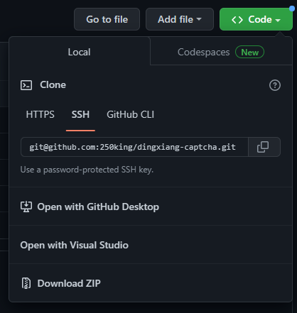
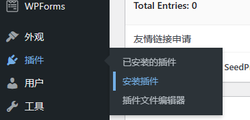
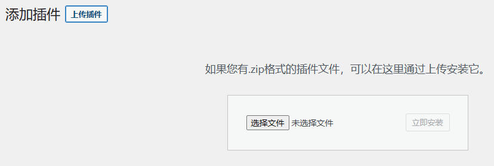
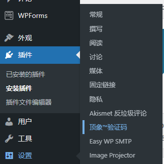

# 顶象™人机验证码 for WordPress
评论区、登录界面等关键地方还是直接“一笔带过”？是时候要为自己的网站安装人机验证码了！

做过网站以及玩过爬虫的人都清楚，WordPress自身是**没有很多防机器注入的措施**，如果连一个基础的图形识别类验证码都没有的话和裸奔基本没区别了！

其实从安全性、用户体验等方面综合考虑，现在流行的拼图验证码是较好的选功能择。作者本人也从每个平台的免费版本各方面互相比较，包括不限于主持的类型、功能丰富性，最终还是投靠了顶象™，并为此特意写了个插件供大家使用。
## 安装
> 目前还在测试阶段，已发布Pre-Release，如果想尝鲜，可以[下载](https://github.com/250king/dingxiang-captcha/releases)安装。也可以直接去[我的网站](https://www.250king.top/)体验一下。
> 
> 暂时不能确定是否有问题，建议有一定动手能力的去弄，小白不建议去弄。
> 
> 有bug请提交Issue。新手上路，难免有不足之处。

1. 直接下载源码，点击Download ZIP
    
    
2. 打开自己的网站管理界面，然后点击左侧导航栏“插件”->“安装插件”

    
3. 上传插件并安装
    
    
4. 激活插件后，点击左侧导航栏“设置”->“顶象™验证码”，完成相关设置

    

    App ID和App Secret请自行前往[https://console.dingxiang-inc.com/#/captcha/services](https://console.dingxiang-inc.com/#/captcha/services)查看